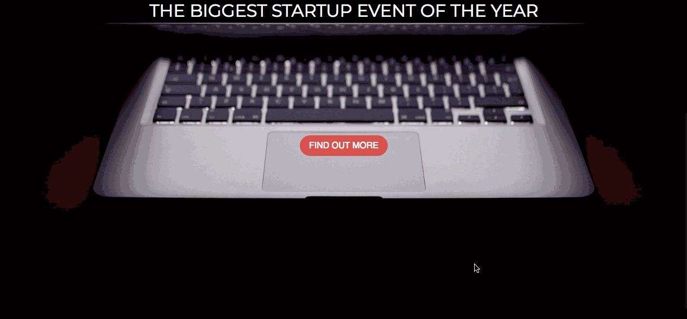

# Web_Dev_Practice_Directory - *Full Stack*

**Full Stack Web development Practice Directory** is a directory of all of the mini projects I do while I improve my web development skills.

Created by: **Claudia Bandali**

Time spent: **2** hours spent in total

## User Stories

The following **practice** projects have been created:

* [x] **Landing Page**

## Video Walkthrough

Here's a sample of my Landing Page:

GIF created with [LiceCap](http://www.cockos.com/licecap/).

## Notes
###Landing Page
Using bootstrap and flexbox to move the elements on the page to the desired position was a bit of a challenge, but made the task easier than it would have been without these tools.

## License

    Copyright [2019] [Claudia Bandali]

    Licensed under the Apache License, Version 2.0 (the "License");
    you may not use this file except in compliance with the License.
    You may obtain a copy of the License at

        http://www.apache.org/licenses/LICENSE-2.0

    Unless required by applicable law or agreed to in writing, software
    distributed under the License is distributed on an "AS IS" BASIS,
    WITHOUT WARRANTIES OR CONDITIONS OF ANY KIND, either express or implied.
    See the License for the specific language governing permissions and
    limitations under the License.
